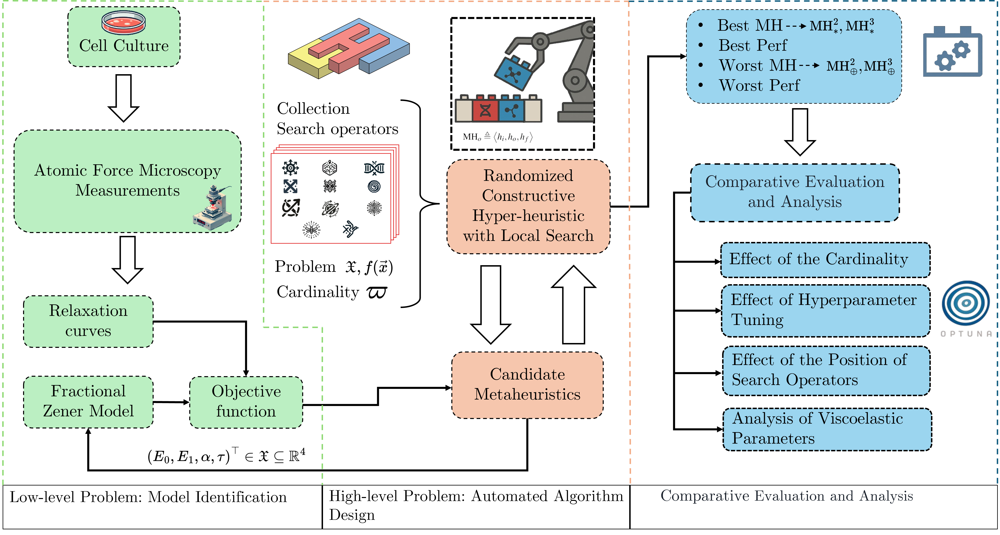

# 🔬 **RCHH-LS_MG63**  
**Viscoelastic Characterization of the Human Osteosarcoma Cancer Cell Line MG-63 Using a Fractional-Order Zener Model Through Automated Algorithm Design and Configuration**

---

## 👥 Authors & Affiliations

|   | Name | Institution |
|---|---|---|
| 🧑‍🔬 | **Grecia C. Duque-Giménez** | UANL – Centro de Investigación en Ciencias Físico-Matemáticas |
| 🧑‍💻 | **Daniel F. Zambrano-Gutiérrez** ¹ *(corresponding)* | Tecnológico de Monterrey – School of Engineering & Sciences |
| 🧑‍🔬 | **Maricela Rodríguez-Nieto** ² ⁶ | UANL / SECIHTI |
| 🧑‍🔬 | **Jorge Luis Menchaca** ² | UANL |
| 🧑‍🔬 | **Jorge M. Cruz-Duarte** ³ | Université de Lille & CNRS – CRIStAL |
| 🧑‍🔬 | **Diana G. Zárate-Triviño** ⁴ | UANL – Laboratorio de Inmunología y Virología |
| 🧑‍🔬 | **Juan Gabriel Avina-Cervantes** ⁵ | University of Guanajuato – IIS |
| 🧑‍🔬 | **José Carlos Ortiz-Bayliss** ¹ | Tecnológico de Monterrey |

¹ Monterrey, México ² San Nicolás de los Garza, México ³ Lille, France  
⁴ UANL Biologics ⁵ Salamanca, México ⁶ Secretaría de Ciencia, Humanidades, Tecnología e Innovación, CDMX

---

## 🧭 Overview of paper content

1. 🧫 Acquire **AFM relaxation curves** for MG-63 cells.  
2. 📐 Fit a **fractional-order Zener model** via a nonlinear objective function.  
3. 🧩 Apply a **Randomised Constructive Hyper-Heuristic with Local Search (RCHH-LS)** to auto-assemble candidate meta-heuristics.  
4. 📊 Run a **comparative evaluation** (cardinality, hyper-parameters, operator order).  
5. 🔎 Analyse the resulting viscoelastic parameters.

---

## 🗂️ Repository contents

| File / folder | Purpose |
|---------------|---------|
| **`RCHH-LS.ipynb`** 📓 | End-to-end notebook that reproduces the RCHH-LS workflow |
| **`Optuna_MH.ipynb`** 📓 | Hyper-parameter-tuning experiments with Optuna |
| **`RCHH-LS.py`** 🐍 | Script version of the workflow (headless execution) |
| **`ml_utils.py`** 🔧 | Utility functions (e.g. Mittag-Leffler implementation) |
| `docs/workflow_diagram.png` | The workflow figure shown above |

---
